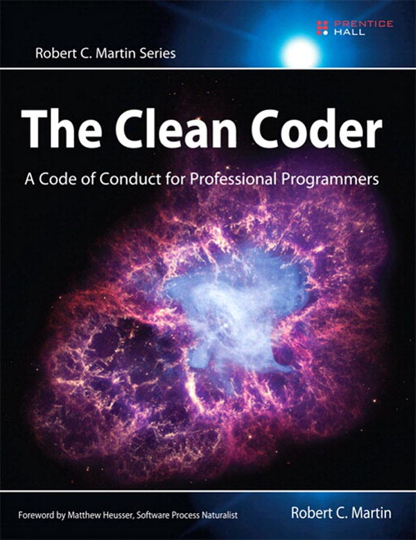

## The Clean Coder 
by Robert C. Martin

This book focuses on set of protocols for a professional developer:
* First chapter starts with professionalism. 
	* Professionalism is a badge of honor and pride, but it is also a marker of responsibility and accountability. 
	* First responsibility, and first goal, of an aspiring professional is to use his or her powers for good. 
	* You must know how your code works. Every single line of code that you write should be tested. Period.
	* If you want your software to be flexible, you have to flex it!
	* Then he focuses on “the Boy Scout rule”: Always check in a module cleaner than when you checked it out.
	*  Professional developers treat software the way a sculptor treats clay—they continuously shape and mold it.
	* Then he talks about work ethic. Your career is your responsibility. It is not your employer’s responsibility to make sure you are marketable. You should plan on working 60 hours per week. The first 40 are for your employer. The remaining 20 are for you. During this remaining 20 hours you should be reading, practicing, learning, and otherwise enhancing your career. Professionals spend time caring for their profession.
	* Next focus goes on `Know your field`. He list out the things that every software professional should be familiar with:
		* Design patterns. You should to be able to describe all 24 patterns in the GOF book and have a working knowledge of many of the patterns in the POSA books.

		* Design principles. You should know the SOLID principles and have a good understanding of the component principles.

		* Methods. You should understand XP, Scrum, Lean, Kanban, Waterfall, Structured Analysis, and Structured Design.

		* Disciplines. You should practice TDD, Object-Oriented design, Structured Programming, Continuous Integration, and Pair Programming.

		* Artifacts: You should know how to use: UML, DFDs, Structure Charts, Petri Nets, State Transition Diagrams and Tables, flow charts, and decision tables.
	* Continuous Learning - For this he compares developer with doctor. Would you visit a doctor who did not keep current with medical journals? Why should employers hire developers who don’t keep current?
	* Practice - Professionals practice. True professionals work hard to keep their skills sharp and ready. Doing your daily job is performance, not practice. Practice is a exercise. For practice he suggests Kata , Coding Dojo. Think of the kata as a 10-minute warm-up exercise in the morning and a 10-minute cool-down in the evening.
	* Collaboration
	* Mentoring
	* Know your domain
	* Humility

* 2nd and 3rd chapter focuses on Saying `No` and `Yes`. 

  > Do; or do not. There is no trying. —Yoda

  Whatever commitments you make you should mean to them, it should not be try.
  If you can’t make your commitment, the most important thing is to raise a red flag as soon as possible to whoever you committed to.
  Business will make further plans based on your commitment. Professionals are not required to say yes to everything that is asked of them. However, they should work hard to find creative ways to make “yes” possible. When professionals say yes, they use the language of commitment so that there is no doubt about what they’ve promised. People are counting on you to be truthful with them.

* Chapter 4 discusses on act of coding. A developer should have capability to sense errors. key to mastery is confidence and error-sense. 
  While coding You must understand what problem you are solving and understand how to solve that problem. Main issue comes in maintaining the necessary concentration and focus for long periods of time. Several solutions of concentration are mentioned in this chapter - TDD and Pair programming.  a software developer who creates many bugs is acting unprofessionally. He finishes the chapter with examples of (Pacing Yourself)A marathon runner takes care of her body both before and during the race. Professional programmers conserve their energy and creativity with the same care.
, (Know when to walk away)  Learn your patterns of creativity and brilliance, and take advantage of them rather than work against them. There sould be a definition of `Done` to avoid the problem of false delivery. Business analysts and testers should create automated acceptance tests that must pass before you can say that you are done. 

* Chapter 5 cover Test-Driven Development.
How can you consider yourself to be a professional if you do not know that all your code works? How can you know all your code works if you don’t test it every time you make a change? How can you test it every time you make a change if you don’t have automated unit tests with very high coverage? How can you get automated unit tests with very high coverage without practicing TDD?
	THE THREE LAWS OF TDD
	1. You are not allowed to write any production code until you have first written a failing unit test.
	2. You are not allowed to write more of a unit test than is sufficient to fail—and not compiling is failing.
	3. You are not allowed to write more production code that is sufficient to pass the currently failing unit test.
	TDD is a discipline that enhances certainty, courage, defect reduction, documentation, and design.

* Chapter 6 covers practicing. All professionals practice their art by engaging in skill-sharpening exercises.
	* The Coding dojo
	* Kata - The purpose of learning a kata is not to perform it on stage. The purpose is to train your mind and body how to react in a particular combat situation. In programming kata, you are practicing the movements and decisions involved in solving the problem.
	You repeat the exercise over and over again to train your brain and fingers how to move and react. Practicing a suite of katas is a good way to learn disciplines such as TDD and CI. Kata is a good way to drive common problem/solution pairs into your subconscious, so that you simply know how to solve them when facing them in real programming.
	http://katas.softwarecraftsmanship.org/
	* Wasa
	* Randori
You can broaden your experience by contributing to open source, practice ethics (Since your practice time is your own time, you don’t have to use the same languages or platforms that you use with your employer). Professionals practice on their own time because they realize that it is their responsibility—and not their employer’s—to keep their skills sharp. Practicing is what you do when you aren’t getting paid. You do it so that you will be paid, and paid well.

* Chapter 7 covers acceptance testing. Business analysts write the “happy path” versions of the tests, because those tests describe the features that have business value. QA typically writes the “unhappy path” tests, the boundary conditions, exceptions, and corner cases. This is because QA’s job is to help think about what can go wrong. Professional developers work with stakeholder’s and QA to ensure that these automated tests are a complete specification of done.

* Chapter 8 focuses on testing strategies. The best role for the QA part of the team is to act as specifiers and characterizers. It defines some strategies and models for looking at unit testing, including an interesting "Test Automation Pyramid"

* Chapter 9 covers Time Management strategies — using techniques like the "Pomodoro" technique to create focus, and the law of two-feet — if you are in a meeting and aren't getting value out of it, you should feel free to leave, or otherwise modify the meeting to get value from it. If you go to a meeting and you find that the agenda has been high-jacked or abandoned, you should request that the new topic be tabled and the agenda be followed.

* Chapter 10 covers several different methods of estimation. In the teams I work with, estimation is perhaps one of the hardest things — not because estimating can be hard (which it can be) but because either they are held so tightly to the estimates that they are afraid to make them, or, worse, they are told what the estimates are going to be. The book really only skims the surface here, covering several techniques from Planning Poker, to PERT, to "Flying Fingers", but gives a decent overview of how to do those techniques.

* The key of chapter 11 is that because you have committed to your principles, practices and disciplines, you should be able to stay calm under pressure. I can certainly say from experience that the worst experiences in my career are when people weren't able to stay calm, and the way the book is laid out, if you are following the practices outlines so far, you should be able to be the voice of reason and calmness.

* The last three chapters cover teams and collaboration. Chapter 12 talks about important practices such as shared code ownership, pairing, and respect for other team members. Chapter 13 covers teams and the importance of having teams that gel together. The book finishes with Chapter 14 and discussions of the importance of apprenticeship, mentorship and craftsmanship.

### Conclusion: 
This book is worth to read. I would recommend developers to read this book atleast once.
